# Themes

HTML transcripts come in two looks:

- **`classic`** — the original look: cards, a gradient background, a stack
  of floating buttons. It is the default.
- **`minimal`** — a compact light/dark theme: messages as dense rows on a
  time rail, long content folded to short previews, and sub-agents and
  rewind forks drawn as **branches** beside the main conversation, which
  you can fold away, weave into the main line, or open side by side in
  columns.

<figure markdown>
  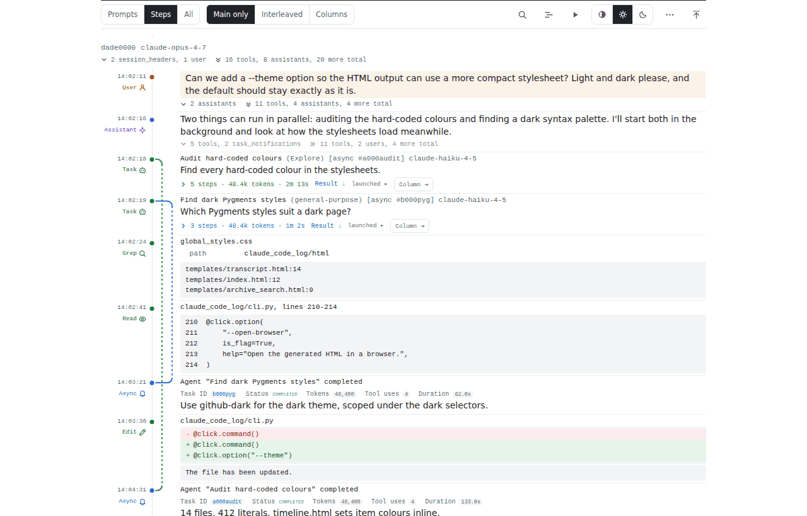
  <figcaption>The minimal theme, <em>Main only</em>: each sub-agent is folded to a line on the row that spawned it, and a dashed lane on the rail runs to where its result arrives.</figcaption>
</figure>

The [example output](example.md) shows a real page in both themes.

## Choosing a theme

Pass `--theme`, or set `CLAUDE_CODE_LOG_THEME`:

```bash
claude-code-log --theme minimal                 # the whole archive
claude-code-log --theme minimal path/to/project # one project
claude-code-log serve --theme minimal           # the local server (and serve --watch)
claude-code-log watch --theme minimal           # watch mode

# The same through the environment — also picked up by the TUI's HTML exports
export CLAUDE_CODE_LOG_THEME=minimal
claude-code-log
claude-code-log --theme classic                 # an explicit flag always wins
```

The accepted values are:

| Value | Meaning |
|---|---|
| `classic` | the original look |
| `minimal` | the compact light/dark theme described below |
| `default` | the built-in default — currently `classic`. Use it to follow whatever the default becomes rather than to pin a look |

Precedence is `--theme`, then `CLAUDE_CODE_LOG_THEME`, then the built-in
default. `--theme default` is an explicit choice too, so it overrides the
environment. An unknown value in `CLAUDE_CODE_LOG_THEME` is an error that
lists the valid ones, never a silent fallback.

Themes apply to HTML only: with `--format md` (or `json`) an explicit
`--theme` is ignored with a warning.

### Switching theme rewrites the archive

Both themes write the **same files** — `combined_transcripts.html`, its
`_2`, `_3` … pages, `session-*.html` — rather than separate copies, and
every page records the theme it was rendered in. So the first run after a
switch regenerates every page in the new theme, and switching back
regenerates them again; an archive is never left half in one theme and half
in the other. Later runs are incremental as usual.

The project index (`index.html`) and the archive search page
(`search.html`) are written on every run, so they always take the run's
theme too — whether the run is a plain `claude-code-log`, `serve`
(and each `serve --watch` refresh) or `watch --all-projects`.

## The minimal theme

### Reading a page

Each message is one row: a narrow **gutter** on the left with its time,
role (`User`, `Assistant`, the tool name …) and tokens, a coloured **dot**
on a continuous vertical **rail**, then the content. Beside the role is a
small **icon** in the role's colour — one per kind of message and per tool
(below) — so you can scan a long page for, say, every edit or every hook
at a glance. A tool call and its output read as one unit; a failed result
shows an `error` pill in the gutter. User prompts are tinted and each one
starts a new turn, separated by a thin rule; other rows are separated by
a fainter hairline across the content.

<figure markdown>
  ![The gutter icons: one per kind of message (user prompt, steering, slash command, output, Bash input, compacted, memory, teammate, async result, assistant, agent, thinking, image, branch), per system message (system, warning, error, hook, recap) and per tool (Read, Write, Edit, MultiEdit, Delete, Bash, Glob, Grep, WebSearch, WebFetch, TaskOutput, TaskStop, TodoWrite, AskUserQuestion, ExitPlanMode, Skill, Artifact, Monitor, ScheduleWakeup, Cron, TaskCreate, TaskUpdate, TaskList, SendMessage, Workflow, workflow phase, ToolExecution, wait), plus tool result, tool error and a wrench for MCP and other tools](assets/themes/icons.png)
  <figcaption>The gutter icons, each in the colour of the rows that use it. Tools without an icon of their own — MCP servers' tools, plugins' — get the wrench; a Read, Write or Edit of a memory file gets the memory bookmark.</figcaption>
</figure>

On a phone, and in a branch's column, the gutter is left-aligned and the
icon comes before the role instead of after it. The icons are decoration:
screen readers, search and the filter read the role's text as before.

Long content shows a **two- or three-line preview** that fades out, with a
`+ N lines` label: a long tool output, file, diff, Bash script, sub-agent
prompt or sub-agent answer. Click the preview (or the label) to open it
and `− less` to close it again; long blocks repeat the `− less` at their
foot.

### The toolbar

The toolbar sticks to the top of the page:

| Control | What it does |
|---|---|
| **Prompts · Steps · All** | Fold depth. *Prompts*: every turn folded to its prompt. *Steps* (default): every turn open, long blocks as previews, sub-agents folded. *All*: everything open, every block in full. Folding a card by hand (its fold bar) clears the selection; choosing a depth again re-applies it everywhere |
| **Main only · Interleaved · Columns** | How every branch is shown (below). Only there when the page has branches |
| 🔍 | Search and filter (also `/`) — the same search and message-type filters as the classic page |
| 📆 | The timeline |
| ⏬ | Follow new messages — only on a page served live (see [Watching a session as it runs](live-updates.md)) |
| ▶ | Copy the command that resumes the session in Claude Code |
| Auto · Light · Dark | Colour scheme. *Auto* follows your system |
| ⋯ | Open or close all details, show user prompts as raw text, show message ids |

The page remembers the fold depth, the branch mode and the colour scheme
in your browser's local storage (the colour scheme is shared with the
project index and the archive search page). Browsers keep that per origin: every page
opened from disk shares one set of choices, and the pages a
`claude-code-log serve` serves share another. If storage is blocked the
page still works, with the defaults.

### Branches

A **branch** is a sub-agent's transcript — synchronous, background
(`run_in_background`) or nested inside another agent, to any depth —, a
workflow agent's transcript (see *Workflows* below), or a
**rewind fork** (a conversation that was rewound and continued
differently; the earliest continuation stays the main line). Each branch
has a control on the row that spawned it — its step count, tokens and
duration — and can be shown in one of four ways:

- **Folded** — *Main only*, the default. Just the control; a dashed lane
  on the rail runs from the spawn to the row where the result came back
  (for a background agent, where its notification arrived). The answer
  itself is on that row, as a preview.
- **Interleaved** — click the control's chevron. The branch's messages
  join the main line at the times they happened, indented, tinted in the
  branch's colour and tagged in the gutter, on a lane of their own that
  forks from the spawn and merges back at the result. At most three
  branches of one turn are interleaved at once: a fourth folds the one you
  opened least recently.
- **In a column** — *Column ⇥* on the control. The branch moves into a
  column of its own to the right, its rows still aligned in time with the
  main line, so you can read both side by side; the page widens and
  scrolls sideways. The column draws the branch's lane like the main
  line's, a dot per message, but only from its first message to its last
  — or down to the row where its result arrives — with a short curve at
  each end pointing back towards the main line. The column's head names
  the branch and gives its stats; *⇤* puts it back into the main line and
  *−* collapses it to a narrow strip (click the strip to open it again).
- **A strip** — a collapsed column.

The toolbar's **Branches** buttons set every branch at once: *Main only*
folds them all, *Interleaved* interleaves the first three of each turn, and
*Columns* opens every branch in a column. A turn with more than three
branches shows the first three controls and a `+N more branches` toggle for
the rest.

<figure markdown>
  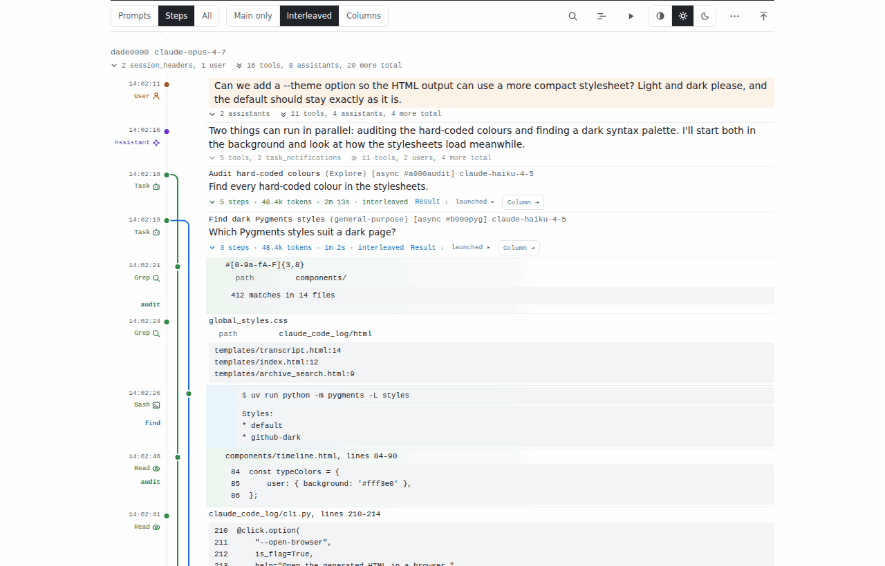
  <figcaption><em>Interleaved</em>: the agents' steps woven into the main line at their real times, each on a lane of its own colour.</figcaption>
</figure>

<figure markdown>
  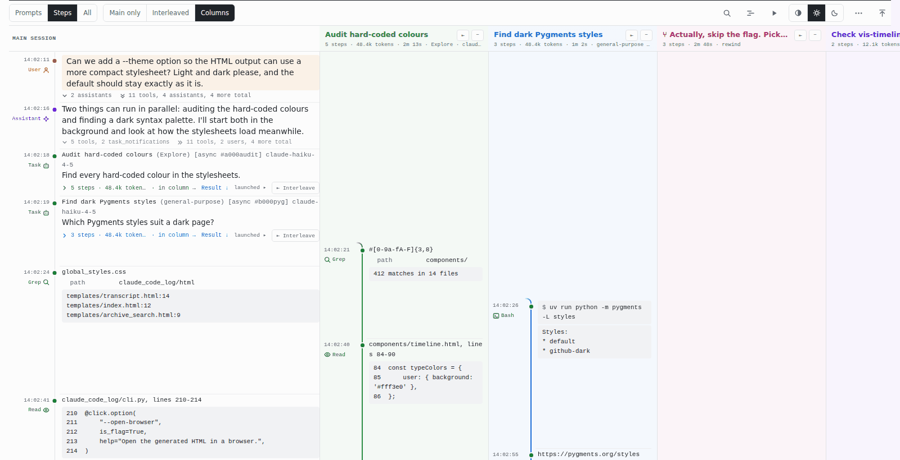
  <figcaption><em>Columns</em>: one column per branch beside the main session, rows aligned in time; each branch's lane runs only while it is active.</figcaption>
</figure>

<figure markdown>
  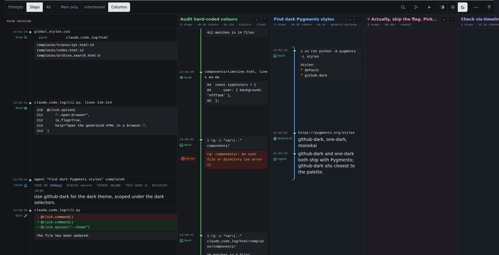
  <figcaption>The same in the dark scheme: each lane ends where the agent's result arrives on the main line, curving back towards it.</figcaption>
</figure>

Search, the timeline and links find their way into branches: a search hit,
a `#msg-…` link or a timeline click inside a folded branch opens it (as a
column if you are in *Columns*, interleaved otherwise) before scrolling to
it. The filter hides the same messages in the transcript and the timeline
whichever way the branches are shown.

**Teammates** (agent teams) are not branches: a teammate's thread stays
folded under the message that spawned it, and the spawn, each
`SendMessage` and each delivered `<teammate-message>` link to one another.

**Workflows** (the `Workflow` tool) show their phases and agents as rows
under the call: each phase, then one row per agent with its result. Every
agent that left a transcript is a branch of its own, spawned at its phase
and merging back at its agent row — folded, interleaved or in a column like
any other. A phase is a group of its own: its first three agents get a
control and *Interleaved* opens those three, the rest wait behind
*+N more agents* on the phase row, and a busy phase never pushes the
turn's other branches (or another phase's agents) out. An agent that
failed without a result says *no result*; one without a transcript stays a
plain row.

<figure markdown>
  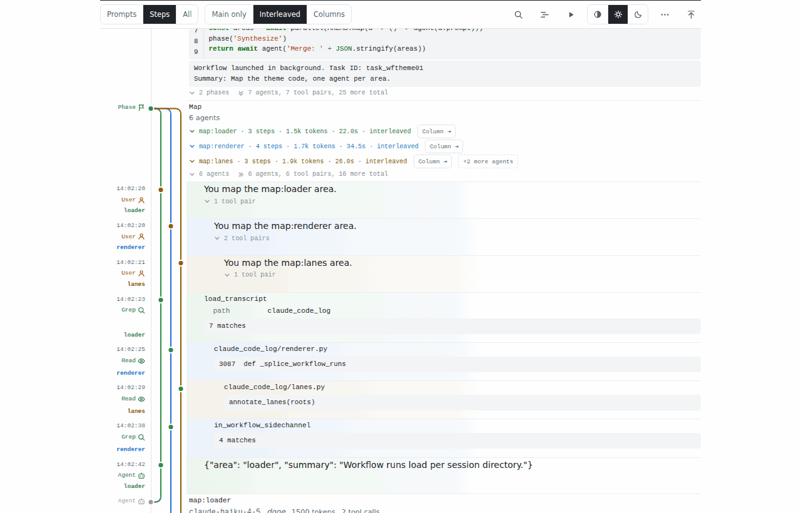
  <figcaption>A workflow in <em>Interleaved</em>: three agents of the <em>Map</em> phase, the rest behind <em>+2 more agents</em>.</figcaption>
</figure>

<figure markdown>
  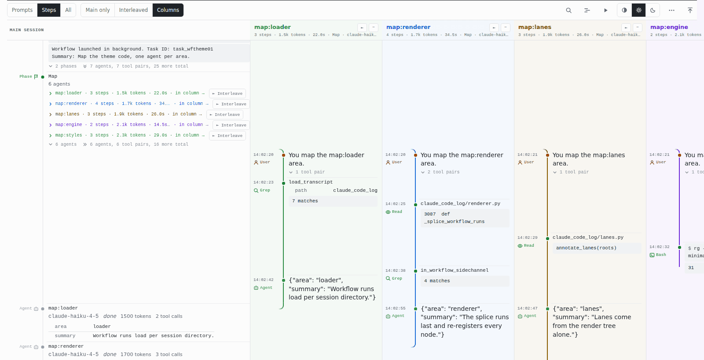
  <figcaption>The same agents in <em>Columns</em>: one column each, their result rows on the main line.</figcaption>
</figure>

On a phone, *Columns* shows one column at a time, the width of the screen:
swipe sideways from one to the next.

### Running agents

On a page served live (`claude-code-log serve --watch`), a sub-agent that
has not returned yet is drawn as **running**: its lane carries on to the
newest message and ends in an open circle, and its control shows a pulsing
*running* label — *running · quiet 42m* once it has been silent for a
minute. When its result arrives it becomes an ordinary merge. Lanes you
opened, interleaved or put in a column stay that way as the page updates,
and a filter or search you have set applies to the new messages too. See
[Watching a session as it runs](live-updates.md).

A page opened from disk never says *running*: an agent without a result
there reads as *no result*.

<figure markdown>
  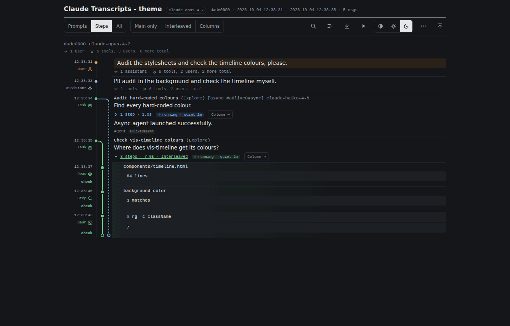
  <figcaption>Dark scheme, served live: a running synchronous agent (interleaved, open end) beside a running background agent (folded, dashed).</figcaption>
</figure>

### Dark mode

The theme follows your system's light or dark setting until you pick
*Light* or *Dark* in the toolbar; *Auto* goes back to following the system.
Everything follows the choice — code highlighting, diffs, the timeline,
teammate colours.

<figure markdown>
  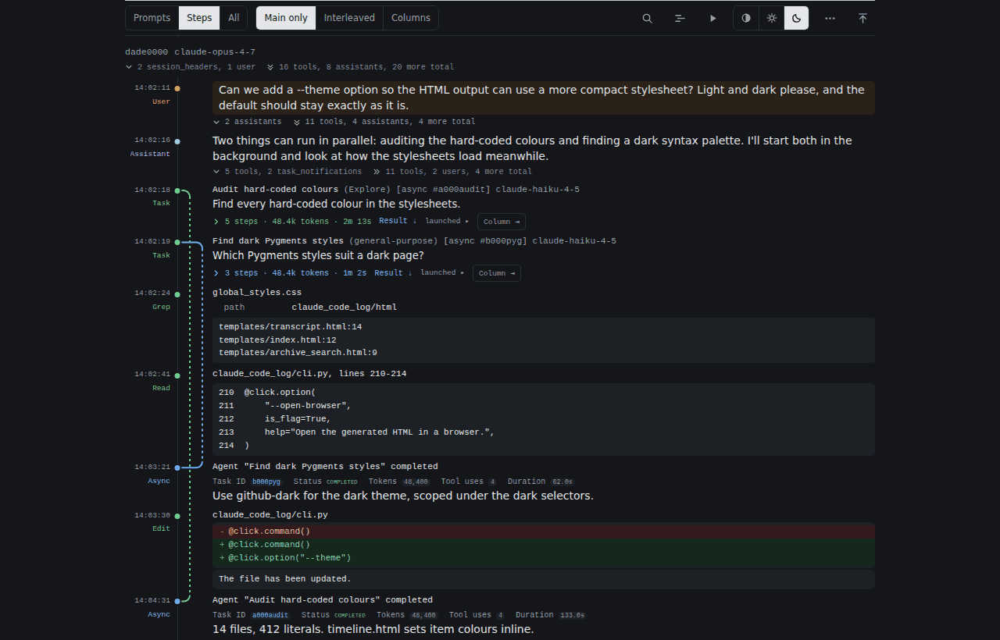
  <figcaption>The same page in the dark scheme.</figcaption>
</figure>

### The project index and archive search

The index lists one project per line — its name, then its sessions,
messages, tokens and date range in small grey type — instead of a card per
project. Click a project's line (anywhere but its name, which opens the
combined transcript) to list its sessions, newest first, each as a row
like a transcript's: the date and time it started, a dot on a rail, its
title and first prompt. The search box above the list finds sessions by
title and first prompt, as before; *Search all transcripts* opens the
archive search.

<figure markdown>
  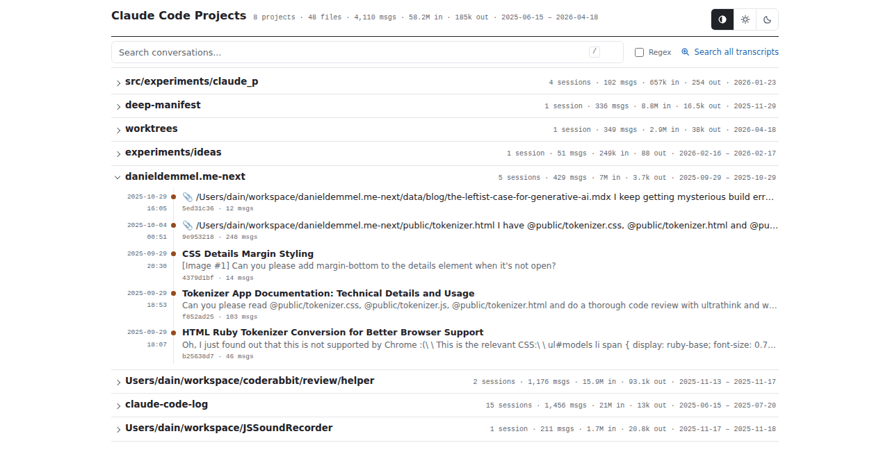
  <figcaption>The project index, one project opened to its sessions.</figcaption>
</figure>

<figure markdown>
  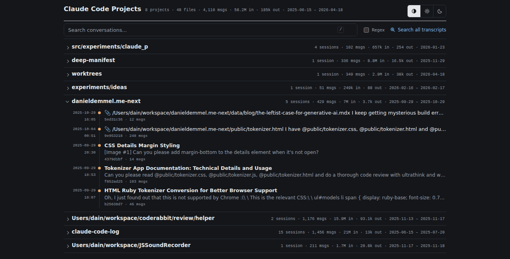
  <figcaption>The same index in the dark scheme.</figcaption>
</figure>

The archive search page (served by `claude-code-log serve`) shows each hit
as a transcript row: the date and time in the gutter with the role —
*User*, *Assistant*, *Tool*, *Result* … — in its colour, a dot of the same
colour on the rail, then the session and the part of the message it
matched in, above the snippet. Hits are grouped by project.

<figure markdown>
  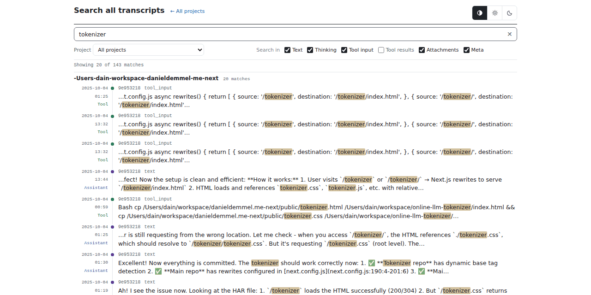
  <figcaption>Archive search: each hit a row, its role in the gutter.</figcaption>
</figure>

<figure markdown>
  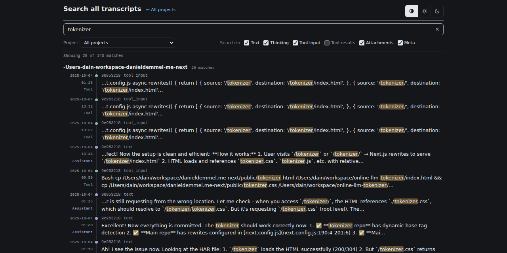
  <figcaption>The same search in the dark scheme.</figcaption>
</figure>

Both pages have the same *Auto · Light · Dark* buttons as a transcript and
share its stored choice: pick *Dark* on the index and the transcripts you
open from it are dark too (and the other way round). Dates are shown in
your time zone; hover one for the full date and time.

### Offline, and without JavaScript

The theme uses your system's fonts and loads nothing from the network. The
one exception is the timeline, which — as in the classic theme — fetches
its charting library from unpkg the first time you open it.

Without JavaScript the page still reads correctly: branches are shown
nested under the message that spawned them, and long blocks keep their
previews (they open with a click; `<details>` needs no script). The
toolbar's controls need JavaScript.

### Not themed (yet)

- Markdown and JSON output have no themes.
